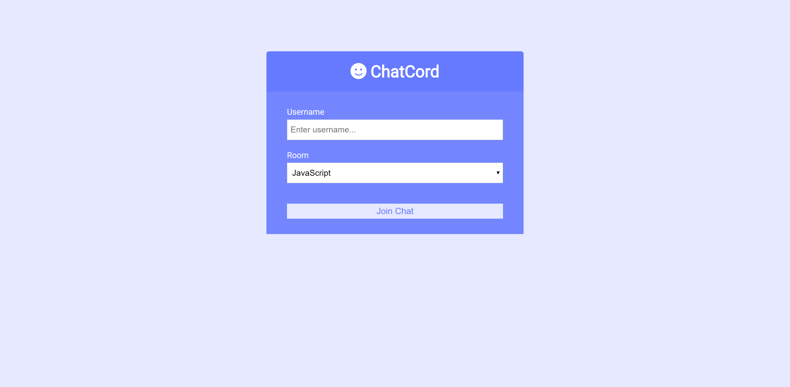

# Chatcord

Realtime chat app with websockets using Node.js, Express and Socket.io with Vanilla JS on the frontend with a custom UI from the Brad Traversy YouTube Channel "Realtime Chat With Users & Rooms - Socket.io, Node & Express".

## Quick Start

### Install dependencies

```
npm install
```

### Run

```
npm run dev
```

## Screenshots

### Home



### Chat-Room


